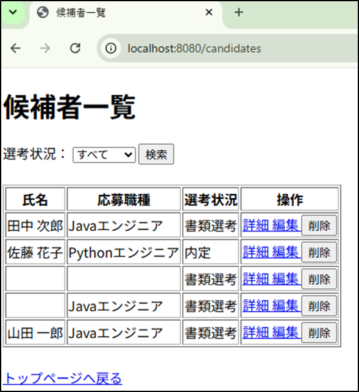
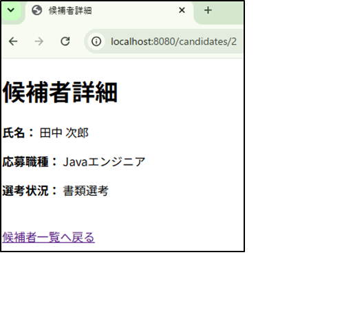
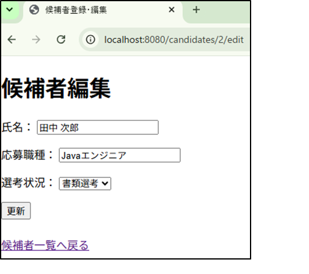
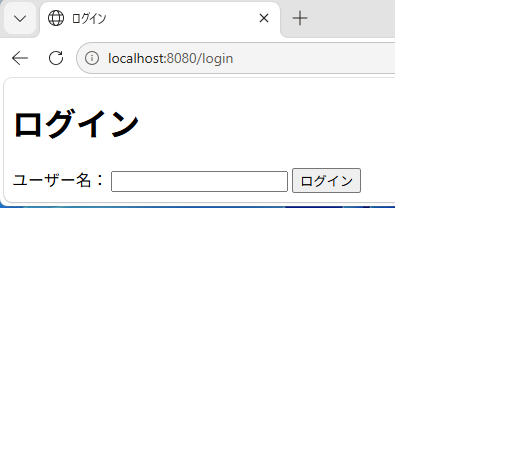

# 採用管理システム

Java / Spring Bootで作成した、採用候補者の選考状況を管理するWebアプリケーションです。

## 概要

候補者の氏名・応募職種・選考状況を登録し、一覧表示・検索・詳細確認・編集・削除ができるシステムを作成しました。

プログラミング学習の一環として、以前学習した採用管理システムをJava / Spring Bootで再構築したポートフォリオです。

## 使用技術

* Java 17
* Spring Boot 4.0.8
* Spring MVC
* Spring Data JPA
* Thymeleaf
* MariaDB 12.3
* Maven
* HttpSession
* HTML

## 主な機能

* 候補者一覧表示
* 候補者登録
* 候補者詳細表示
* 候補者編集
* 候補者削除
* 選考状況による検索
* 入力値バリデーション
* バリデーションエラー表示
* MariaDBへのデータ保存
* ログイン機能
* ログアウト機能
* セッションによるログイン状態の管理

## 画面

### トップページ

採用管理システムのトップページから、候補者一覧や新規登録画面へ移動できます。

### 候補者一覧

登録されている候補者を一覧表示します。

選考状況を指定して、候補者を絞り込むことができます。




### 候補者詳細

候補者の登録内容を確認できます。




### 候補者編集

候補者の氏名、応募職種、選考状況を編集できます。



氏名が未入力の場合は、バリデーションエラーを表示します。


### ログイン画面

ユーザー名を入力してログインできます。
ログイン後は候補者一覧画面へ移動します。




## アプリケーション構成

```text
ブラウザ
   ↓
HTML / Thymeleaf
   ↓
Spring Boot / Spring MVC
   ↓
Java
   ↓
Spring Data JPA
   ↓
MariaDB
```
## ファイル役割

| **MVC**        | **ファイル**                   | **役割**                  |
| -------------- | -------------------------- | ----------------------- |
| **Entity**     | `Candidate.java`           | 候補者データを定義               |
| **Repository** | `CandidateRepository.java` | DBの候補者データを取得・保存・更新・削除   |
| **Controller** | `HomeController.java`      | ブラウザからのリクエストを受け取り、処理を行う |
| **Controller** | `LoginController.java` | ログイン・ログアウト処理を行う |
| **View**       | `login.html` | ログイン画面を表示 |
| **View**       | `candidates.html`          | 候補者一覧を表示                |
| **View**       | `candidate-form.html`      | 候補者の登録・編集画面を表示          |
| **View**       | `candidate-detail.html`    | 候補者の詳細画面を表示             |
| **View**       | `candidate-detail.html`    | 候補者の詳細画面を表示             |


## データベース

データベースにはMariaDBを使用しています。

主なテーブル：

```text
candidate
├── id
├── name
├── position
└── status
```

## 工夫した点

### 1. 選考状況による検索

Spring Data JPAのメソッドを利用し、選考状況に応じて候補者を絞り込めるようにしました。

```java
List<Candidate> findByStatus(String status);
```

### 2. 入力値バリデーション

候補者名を必須項目とし、未入力の場合はエラーメッセージを表示するようにしました。

```java
@NotBlank(message = "氏名を入力してください")
private String name;
```

### 3. 登録と編集でフォームを共通化

候補者IDの有無によって、同じフォームを登録・編集の両方で利用できるようにしました。


### 4. セッションによるログイン状態の管理

HttpSessionを利用してログインユーザーの情報をセッションに保存し、
ログイン後の画面遷移とログアウト処理を実装しました。
